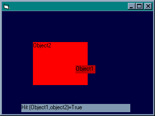

<div align="center">

## Knowing whether two objects  intersect


</div>

### Description

This simple function let you easily know if two objects intersect. You can use it for making games or for any other purpose.
 
### More Info
 


<span>             |<span>
---                |---
**Submitted On**   |
**By**             |[Tarek Said](https://github.com/Planet-Source-Code/PSCIndex/blob/master/ByAuthor/tarek-said.md)
**Level**          |Intermediate
**User Rating**    |5.0 (10 globes from 2 users)
**Compatibility**  |VB 4\.0 \(32\-bit\), VB 5\.0, VB 6\.0
**Category**       |[Coding Standards](https://github.com/Planet-Source-Code/PSCIndex/blob/master/ByCategory/coding-standards__1-43.md)
**World**          |[Visual Basic](https://github.com/Planet-Source-Code/PSCIndex/blob/master/ByWorld/visual-basic.md)
**Archive File**   |[](https://github.com/Planet-Source-Code/tarek-said-knowing-whether-two-objects-intersect__1-26121/archive/master.zip)


### Source Code

```
Public Function Hit(Object1 As Object, Object2 As Object) As Boolean
If Object1.Left > Object2.Left - Object1.Width And Object1.Left - Object2.Width < Object2.Left And Object1.Top - Object2.Top < Object2.Top And Object1.Top > Object2.Top - Object1.Top Then Hit = True
If Object1.Left > Object2.Left - Object1.Width And Object1.Left - Object2.Width < Object2.Left And Object1.Top - Object2.Height < Object2.Top And Object1.Top > Object2.Top - Object1.Height Then Hit = True
End Function
```

